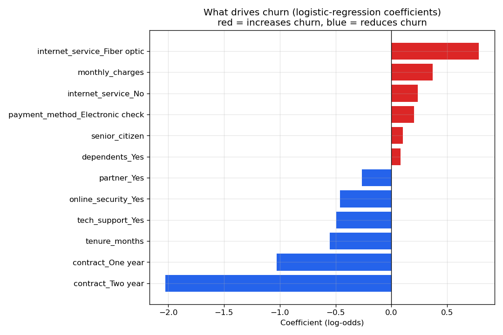

# Customer Churn Analysis

An end-to-end **analytics + machine-learning** study of why telecom customers leave,
using a synthetic dataset of **7,000 customers** (~30% churn rate). The script goes from 
raw data → EDA → a predictive model → **business recommendations** —
mirroring how a Data/Business Analyst turns data into decisions.

---

##  Project structure

```
02-customer-churn-analysis/
├── data/
│   ├── generate_churn_data.py   # builds the synthetic dataset (seeded)
│   └── telco_churn.csv          # 7,000 customers, 14 features
├── figures/                     # all charts, regenerated on each run
│   ├── 01_churn_by_category.png
│   ├── 02_tenure_distribution.png
│   ├── 03_churn_by_tenure_bucket.png
│   ├── 04_roc_curve.png
│   └── 05_churn_drivers.png
├── churn_analysis.py            # the full analysis
└── requirements.txt
```

## What the analysis does

1. **Data-quality check** — row counts, missing values, duplicates, base churn rate.
2. **EDA** — churn rate broken down by contract, internet service and payment method;
   tenure distributions for churned vs retained customers; churn across tenure buckets.
3. **Predictive model** — a `LogisticRegression` pipeline (scaling + one-hot encoding,
   class-weighting for imbalance) with a train/test split and full evaluation.
4. **Driver analysis** — model coefficients converted to **odds ratios** so each factor
   is readable as "*×N more / less likely to churn*", plus written recommendations.

---

## Results

**Model performance** — ROC-AUC **0.82**, recall on churners **0.78** (the metric that
matters for retention: catching customers before they leave).

**Churn drivers** (odds ratios from the model):

| Increases churn | ×odds | Reduces churn | ×odds |
|-----------------|------:|---------------|------:|
| Fiber-optic internet | 2.19 | Two-year contract | 0.13 |
| Higher monthly charges | 1.45 | One-year contract | 0.36 |
| Electronic-check payment | 1.22 | Longer tenure | 0.57 |
| Senior citizen | 1.11 | Tech support add-on | 0.61 |

**Key insight:** *contract type and tenure dominate.* A two-year contract makes a customer
**~7× less likely** to churn than month-to-month, and churn falls steeply over the first
year of tenure.



---

## Recommendations

1. **Migrate month-to-month customers to annual contracts** — the single strongest lever.
2. **Protect the first 6 months** with onboarding and early check-ins.
3. **Bundle tech support & online security**, especially for fiber subscribers.
4. **Revisit fiber pricing/value** — premium price, premium churn.
5. **Nudge electronic-check payers** toward automatic payment methods.

