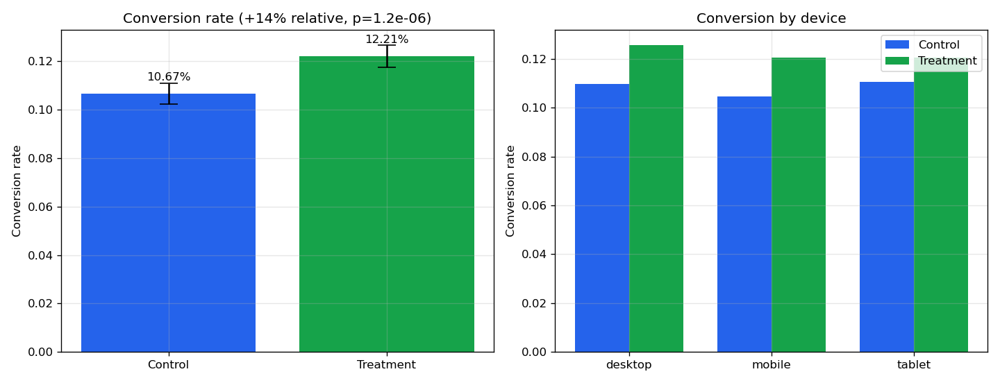

#  A/B Test Analysis — Checkout Experiment

A full **experimentation analysis**: an e-commerce store tests a new **one-page checkout**
(treatment) against its current **multi-step checkout** (control) across **40,000 user
sessions**, and we decide — with statistics — whether to ship it.

---

##  Project structure

```
04-ab-test-analysis/
├── data/
│   ├── generate_experiment.py   # builds the synthetic experiment (seeded)
│   └── experiment.csv           # 40,000 sessions
├── figures/
│   └── 01_ab_results.png        # conversion + per-device comparison
├── ab_test_analysis.py          # the full analysis
└── requirements.txt
```

---

## What the analysis does

1. **Sanity checks** — group summary + a **Sample-Ratio-Mismatch (SRM)** test to confirm
   random assignment really was ~50/50 (a check most beginners skip).
2. **Conversion lift** — a **two-proportion z-test** with a 95% confidence interval on the
   difference, plus absolute and relative lift.
3. **Revenue per user** — a **Welch's t-test** to confirm extra conversions aren't coming at
   the cost of smaller baskets (the classic "guardrail metric").
4. **Statistical power** — Cohen's *h*, achieved power, and the per-group sample size that
   would be needed for 80% power.
5. **Segmentation** — conversion lift broken out by device, to check the effect is broad and
   not driven by a single segment.
6. **Recommendation** — an automated ship / no-ship decision based on significance,
   CI direction and power.

---

## Result

| Metric | Control | Treatment | Lift |
|--------|--------:|----------:|-----:|
| Conversion rate | 10.67% | 12.21% | **+1.55pp (+14.5%)** |
| Revenue per user | €6.21 | €7.26 | **+€1.05** |

- **Conversion lift is statistically significant** (z = 4.85, **p ≈ 1.2 × 10⁻⁶**); the 95%
  confidence interval on the difference is **+0.92pp to +2.17pp** — comfortably above zero.
- **Well-powered** at ~100% for the observed effect, so the result is trustworthy.
- Revenue per user moved in the **same direction** — no cannibalisation.
- The lift holds on **desktop and mobile**; on tablet it's directionally positive but not
  significant (small sample) — worth a follow-up.





